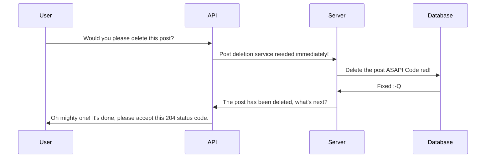

## Yatube API Educational Project
### You kiddin' me? Another educational project?

Exactly! Implementation of REST API for a sample Django project using DRF. The task was to create an API based on redoc-based documentation from scratch: models, request routing, serialization, permissions, JWT, and so on.

After installation, you'll be able to read the docs and test the project, using a built in web interface, or some kind of software (I would recommend **PostMan**)

#### Technology stack

- Python 3.7.13, Django 2.2.16, Django REST Framework 3.12.4, SimpleJWT 4.7.2, PyJWT 2.1.0, Djoser 2.1.0, Pillow 9.2.0

#### Keypoints

- This implementation is built on viewsets.
- JWT tokens used for authentication.
- Read-only access for unauthenticated users to all endpoints except for _/follow/_.
- Authenticated users are allowed to modify/delete their content, read-only access in all other cases.

### Installation

```
git clone https://github.com/holohup/yatube_api_en && cd yatube_api_en && ./yatube_api_install.sh
```

The project comes preloaded with some fixtures which are installed on the script execution. There's a registered admin user **tester/tester**, the admin web interface is accessible at http://127.0.0.1:8000/admin/

You can register a new user from there, or use the admin credentials to get a token by sending a POST request to http://127.0.0.1:8000/api/v1/jwt/create/ containing a JSON:

```
{
    "username": "string",
    "password": "string"
}
```

The JWT token will be under the key named "**access**". After that, set up your software to use it and explore the API at your will!

### The Ultimate Task (how the project should work and how it does, on yes)

Check out this link to learn which requests it should accept, which responses it returns all the necessary details:
http://127.0.0.1:8000/redoc/#tag/api

### How it works



### Request examples

- get post comments

> /api/v1/posts/{post_id}/comments/{id}/

Response:
```
{
-   "id": 0,   
-   "author": "string", 
-   "text": "string",  
-   "created": "2019-08-24T14:15:22Z",  
-   "post": 0
}
```

Feel free to send all allowed kinds of requests and test my solution back and forth!
