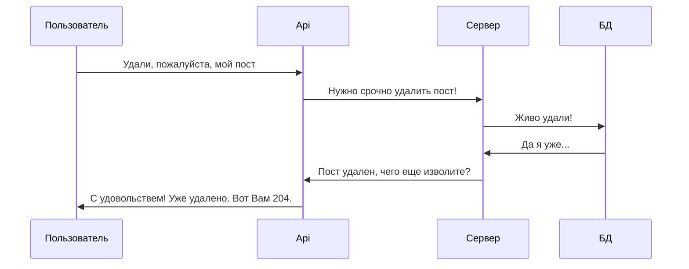

# Добро пожаловать в проект api_yatube!

Подключите проект к фронтэнду проекта yatube, чтобы он мог работать с первой версией api. Это даст возможность оперативно взаимодействовать с базой как прямо с SPA, так и с мобильной версии приложения, или из удобного **PostMan**.

## Сразу к делу:

1) После клонирования репозитария перейдите в папку, создайте виртуальное окружение, установите зависимости, выполните миграции и вперед, к **новым высотам** через запуск проекта:

### Запускаем на раз-два-три:

#### Скопируйте эту строку в свой терминал
```
git clone https://github.com/holohup/api_final_yatube.git && cd api_final_yatube && ./yatube_api_install.sh
```

## Принцип работы
 У нея внутре неонка!


### Примеры запросов и ответов

- получение комментария к посту

> /api/v1/posts/{post_id}/comments/{id}/

Ответ:
```
{
-   "id": 0,   
-   "author": "string", 
-   "text": "string",  
-   "created": "2019-08-24T14:15:22Z",  
-   "post": 0
}
```

## Все эндпоинты, ошибки (hopefully) и ответы проекта доступны в виде yaml-файла

...после установки будут доступны на локальном веб-сервере по адресу: 
> http://127.0.0.1:8000/redoc/#tag/api