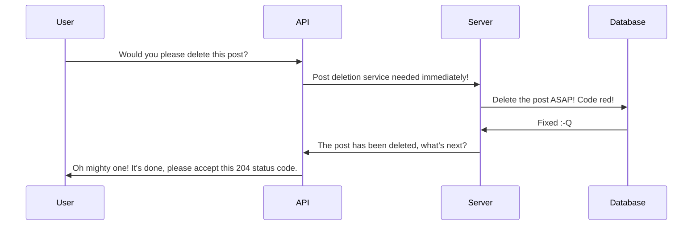

## Yatube API Educational Project
### You kiddin' me? Another educational project?

Exactly! An implementation of REST Api for a sample Django project using DRF. The task was to to create an API based on redoc-based documentation from scratch: models, request routing, serialization, permissions, JWT, and so on.

After installation, you'll be able to read the docs and test the project, using built-in web interface, or some kind of software (I would recommend **PostMan**)

#### Keypoints

- This implementation is built on viewsets.
- JWT-tokens used for authentication.
- Read-only access for unauthenticated users to all endpoints except for _/follow/_.
- Authenticated users are allowed to modify/delete their own content, read-only access in all other cases.

### Installation

```
git clone https://github.com/holohup/yatube_api_en && cd yatube_api_en && ./yatube_api_install.sh
```

### The Ultimate Task (how the project should work and how it does, on yes)

Check out this link to learn which requests it should accept, which responses it returns and all the necessary details:
http://127.0.0.1:8000/redoc/#tag/api

### How it works



### Request examples

- get post comments

> /api/v1/posts/{post_id}/comments/{id}/

Response:
```
{
-   "id": 0,   
-   "author": "string", 
-   "text": "string",  
-   "created": "2019-08-24T14:15:22Z",  
-   "post": 0
}
```

Feel free to send all allowed kinds on requests and test my solution back and forth!
